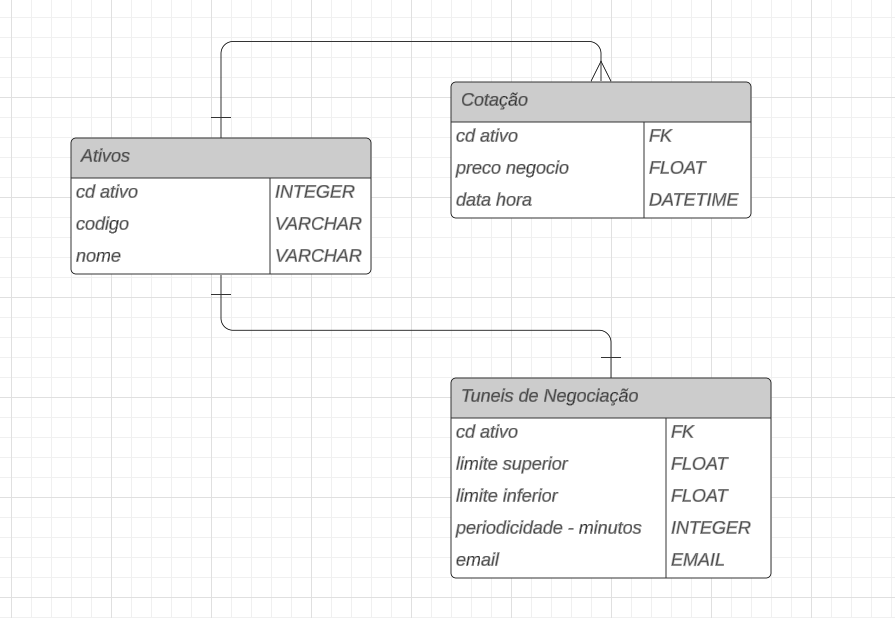

# DESAFIO AT INOA - Aplicativo Django para Monitoramento de Ações

## Sumário

- [Descrição Geral](#descrição-geral)
- [Modelos e Relacionamentos](#modelos-e-relacionamentos)
- [Funcionamento Geral](#funcionamento-geral)
- [Schedulers e Monitoramento de Ações](#schedulers-e-monitoramento-de-ações)
- [Configuração do Banco de Dados](#configuração-do-banco-de-dados)
- [Instalação e Configuração](#instalação-e-configuração)

## Descrição Geral

Este aplicativo Django foi desenvolvido para auxiliar investidores no monitoramento de ações da bolsa de valores B3. Ele permite a criação de alertas personalizados com base em limites de preços e executa tarefas agendadas para verificar e registrar as cotações das ações em intervalos definidos pelo usuário.

## Modelos e Relacionamentos

### Modelo de Entidade-Relacionamento (ERD)



- **Ativo**
  - `codigo`: Código do ativo na bolsa (ex: PETR4)
  - `nome`: Nome completo do ativo (ex: Petrobras)

- **Cotacao**
  - `ativo`: Relacionamento com o modelo **Ativo**
  - `preco_negocio`: Preço da última negociação registrada
  - `data_hora`: Data e hora da cotação

- **TunelParametro**
  - `ativo`: Relacionamento com o modelo **Ativo**
  - `limite_superior`: Limite superior de preço para alerta
  - `limite_inferior`: Limite inferior de preço para alerta
  - `periodicidade`: Intervalo de tempo (em minutos) para o agendamento da verificação de preço
  - `email`: Conta de email que receberá as atualizações do túnel de preço

### Relacionamentos

- **Ativo** one-to-many com **Cotacao**
- **Ativo** one-to-one com **TunelParametro**

Obs 1: O modelo ER presente não possui uma tabela de usuário, isso indica que todos os monitoramentos são compartilhados entre todos os possiveis usuários que acessam o sistema. A presença de uma tabela de usuário significaria a criação de funcionalidades de Cadastro, Login, Recuperação de Senha, entre outras.  

Obs 2: a presença de um relacionamento one-to-one entre **Ativo** e **TunelParametro** indica que somente um monitoramento por ação é possivel ao mesmo tempo, dessa forma ao criar um novo monitoramento para uma ação que já possui um monitoramento existente, o monitoramento existente será substituido.

## Funcionamento Geral

O aplicativo desenvolvido possui uma interface gráfica que lista todos os ativos disponiveis e permite ao usuário monitorar cotações de ações específicas. O usuário pode definir limites de preços superior e inferior e configurar intervalos de tempo para monitoramento e deve informar um email de contato para que os alertas sejam enviados.

Quando os preços das ações ultrapassam os limites definidos, o aplicativo envia alertas em forma de emails automatizados ao usuário sugerindo a compra ou venda de tal ação. Além disso, todas as cotações registradas nos intervalos definidos são armazenadas no banco de dados para futuras consultas e análise.

## Schedulers e Monitoramento de Ações

### Funcionamento dos Schedulers

### 1. **Scheduler de Listar Ativos**: 
O aplicativo conta com um scheduler responsável por manter a lista de ativos atualizada no banco de dados. Aqui está uma explicação do funcionamento:

#### 1. **Função `fetch_available_stocks`**

Essa função realiza a seguinte operação:

- **Consulta à API BRAPI**: Faz uma requisição à API BRAPI para obter uma lista de todos os ativos disponíveis.
- **Retorno dos Ativos**: Retorna uma lista de códigos de ativos que são obtidos da API.

#### 2. **Função `fetch_stock_name`**

Responsável por obter o nome completo de um ativo:

- **Consulta à API BRAPI**: Para cada código de ativo, faz uma requisição à API BRAPI para obter o nome completo.
- **Tratamento de Erros**: Se a consulta falhar ou o nome não estiver disponível, retorna uma mensagem padrão ou um nome gerado a partir do código do ativo.

#### 3. **Função `insert_stocks_into_db`**

Essa função gerencia a inserção de novos ativos no banco de dados:

- **Verificação de Existência**: Primeiro, verifica se o ativo já existe no banco de dados.
- **Inserção ou Atualização**: Se o ativo não existir, ele é inserido com o nome obtido. Se o nome não puder ser recuperado, um nome padrão é definido.

#### 4. **Função `update_stock_list`**

Executa o fluxo completo para atualizar a lista de ativos no banco de dados:

- **Busca e Inserção**: Chama as funções `fetch_available_stocks` e `insert_stocks_into_db` para buscar os ativos disponíveis e inseri-los no banco de dados.

#### 5. **Função `start_stock_update_scheduler`**

Essa função inicia o scheduler para atualizar a lista de ativos diariamente:

- **Criação do Scheduler**: Utiliza o `APScheduler` para criar uma tarefa que atualiza a lista de ativos a cada 24 horas.
- **Execução Imediata**: Além de agendar a tarefa, a função também força uma execução imediata da atualização ao iniciar o servidor.

Essas funções garantem que a lista de ativos no banco de dados esteja sempre atualizada, permitindo ao usuário monitorar novos ativos assim que eles se tornam disponíveis no mercado.

### 2. **Scheduler de Monitorar Ativos**: 
O aplicativo utiliza o `APScheduler` para monitorar periodicamente as cotações de ações. A seguir, uma breve explicação do funcionamento do scheduler:

#### 1. **Função `verificar_preco`**

A função `verificar_preco` é responsável por:

- **Buscar a cotação atual de uma ação** utilizando a API BRAPI.
- **Registrar a cotação** no banco de dados.
- **Enviar alertas por e-mail** ao usuário caso a cotação ultrapasse os limites de preço definidos (inferior ou superior).

#### 2. **Função `create_monitorar_ativos_scheduler`**

Essa função cria ou reprograma um job para monitorar um ativo específico:

- **Intervalo de Monitoramento**: Define o intervalo de tempo em minutos em que o preço da ação será verificado.
- **Reprogramação**: Se um monitoramento já existe para o ativo, ele é reprogramado com os novos parâmetros.

#### 3. **Função `monitorar_todos_os_ativos`**

Essa função inicializa o monitoramento de todos os ativos que possuem parâmetros configurados:

- **Iteração sobre Ativos**: Itera sobre todos os ativos monitorados e cria um job para cada um.
- **Criação de Jobs**: Cada ativo é monitorado em intervalos específicos, conforme definido pelo usuário.
- **Início do Scheduler**: Após a criação dos jobs, o scheduler é iniciado, ativando o monitoramento contínuo.

O scheduler garante que as cotações das ações sejam verificadas regularmente e que os usuários recebam alertas caso as condições estabelecidas sejam atendidas.

### Utilização da API BRAPI

A API BRAPI permite obter dados de cotações de ativos financeiros. Abaixo, é descrito um exemplo de utilização da API para obter informações sobre o ativo **FNAM11**.

#### Exemplo de Requisição

A requisição à API pode ser feita usando o seguinte endpoint:
https://brapi.dev/api/quote/FNAM11?token=cfAWDpKFkPa6ZeN6B3Cxyo

#### Resposta JSON

A resposta da API é um JSON que contém informações detalhadas sobre o ativo, como preço atual, variação diária, volume de negociação, e mais. Abaixo está um exemplo de resposta:

```json
{
	"results": [
		{
			"currency": "BRL",
			"shortName": "FINAM       CI *",
			"longName": "Fundo de Investimento Amazônia - FINAM",
			"regularMarketChange": 0,
			"regularMarketChangePercent": 0,
			"regularMarketTime": "2024-08-22T19:51:23.000Z",
			"regularMarketPrice": 0.41,
			"regularMarketDayHigh": 0.41,
			"regularMarketDayRange": "0.39 - 0.41",
			"regularMarketDayLow": 0.39,
			"regularMarketVolume": 25420000,
			"regularMarketPreviousClose": 0.41,
			"regularMarketOpen": 0.45,
			"fiftyTwoWeekRange": "0.39 - 0.41",
			"fiftyTwoWeekLow": 0.39,
			"fiftyTwoWeekHigh": 0.41,
			"symbol": "FNAM11",
			"priceEarnings": null,
			"earningsPerShare": null,
			"logourl": "https://s3-symbol-logo.tradingview.com/amazonia-on-es--big.svg"
		}
	],
	"requestedAt": "2024-08-22T21:12:33.962Z",
	"took": "0ms"
}
```

### Envio de email

O aplicativo utiliza o serviço de e-mail do Gmail para enviar notificações automatizadas aos usuários da seguinte forma:

- No arquivo `settings.py` do seu projeto Django, configure o backend de e-mail para usar o Gmail. As configurações típicas são:

     ```python
     EMAIL_BACKEND = 'django.core.mail.backends.smtp.EmailBackend'
     EMAIL_HOST = 'smtp.gmail.com'
     EMAIL_PORT = 587
     EMAIL_USE_TLS = True
     EMAIL_HOST_USER = 'seuemail@gmail.com'
     EMAIL_HOST_PASSWORD = 'suasenha'
     ```

## Configuração do Banco de Dados

Este projeto utiliza o PostgreSQL como banco de dados, mas é possível utilizar outros bancos, como o SQLite ou MySQL. Abaixo estão as etapas para configurar o banco de dados:

#### 1. Configuração do PostgreSQL

1. **Instalação do PostgreSQL**: Para o funcionamento do Postgres no app Django é necessário a instalação po pacote psycopg2, tambem é necessária a configuração do banco no arquivo settings.py da seguinte forma:
``` Python
DATABASES = {
    'default': {
        'ENGINE': 'django.db.backends.postgresql',
        'NAME': 'nome_do_banco',
        'USER': 'nome_do_usuario',
        'PASSWORD': 'sua_senha',
        'HOST': 'localhost',  # ou o endereço do seu servidor de banco de dados
        'PORT': '5432',  # padrão do PostgreSQL
    }
}
```

## Instalação e Configuração

### 1. Clonar o Repositório

Primeiro, clone o repositório do projeto para sua máquina local:

```bash
git clone https://github.com/pedrobolzan/DESAFIO-AT-INOA.git
cd DESAFIO-AT-INOA
```

2. Instale o Pipenv e utilize-o para instalar todas as dependencias do projeto
```bash
pip install pipenv

pipenv shell

pipenv install

```

3. Para realizar as migrações no banco de dados selecionado, utilize o comando:
```bash
cd DESAFIO-AT-INOA-DJANGO

python manage.py migrate
```

4. Para executar o servidor localmente, rode o seguinte comando:
```bash
python manage.py runserver
```